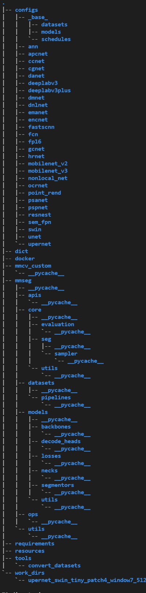

# Swin-Transformer-segmentation


## 一. 文件结构

该模型主要由configs、mmseg、tools、work_dirs几个主要文件夹组成

**configs：**该文件夹存放有模型训练有关的所有配置文件，其中除base外文件夹存放的为特定模型的详细配置文件

**mmseg：**模型运行所需的一些api

**tools：**test与train脚本存放于该文件夹内，但部分情况需要将该文件移出至根目录下再进行使用

**work_dirs：**模型默认保存训练信息的目录




## 二. 配置文件

该部分可分为_base_与其他详细配置两部分

#### base

该部分有datasets，models，schedule以及default_runtime.py四类配置文件，分别配置模型所需的一部分参数

#### 详细配置

该配置文件为模型train/eval所调用的配置文件，在该配置文件头部添加_base_字段来合并其他配置文件,可进行覆盖

``` python
_base_ = [
    '../_base_/models/upernet_swin.py', '../_base_/datasets/ade20k.py',
    '../_base_/default_runtime.py', '../_base_/schedules/schedule_160k.py'
]
```


## 三. 数据准备

该部分配置信息填写在configs/base/datasets/ade20k.py中，数据集格式如下

```markdown

    │   ├── my_dataset
    │   │   ├── img_dir
    │   │   │   ├── train
    │   │   │   │   ├── xxx{img_suffix}
    │   │   │   │   ├── yyy{img_suffix}
    │   │   │   │   ├── zzz{img_suffix}
    │   │   │   ├── val
    │   │   ├── ann_dir
    │   │   │   ├── train
    │   │   │   │   ├── xxx{seg_map_suffix}
    │   │   │   │   ├── yyy{seg_map_suffix}
    │   │   │   │   ├── zzz{seg_map_suffix}
    │   │   │   ├── val
```


示例：imgSet: ADE_train_00000001.jpg, ADE_val_00000001.jpg

​	   annSet: ADE_train_00000001.png,ADE_val_00000001.png

图片名字需对齐

## 四. 进行训练

使用`tools/train.py`或`tools/dist_train.sh`，如报错找不到**mmseg**，可将train.py移至根目录下

#### 使用预训练模型进行训练

```
# single-gpu training
python train.py <CONFIG_FILE> --options model.pretrained=<PRETRAIN_MODEL> [model.backbone.use_checkpoint=True] [other optional arguments]

# multi-gpu training
tools/dist_train.sh <CONFIG_FILE> <GPU_NUM> --options model.pretrained=<PRETRAIN_MODEL> [model.backbone.use_checkpoint=True] [other optional arguments]
```

#### 实例

```
# 使用Swin-T+UPerNet以及8 gpus
tools/dist_train.sh configs/swin/upernet_swin_tiny_patch4_window7_512x512_160k_ade20k.py 8 --options model.pretrained="./swin_tiny_patch4_window7_224.pth"

# 使用Swin-T+UPerNet以及单gpu
python train.py configs/swin/upernet_swin_tiny_patch4_window7_512x512_160k_ade20k.py --options model.pretrained="./swin_tiny_patch4_window7_224.pth" --launcher none --no-validate
```

## 五. 对模型进行验证

## 六. 对单张图片进行推理

位于`demo/image_demo.py`

```
# inference single image
python demo/image_demo.py  <CONFIG> <CHECKPOINT>

# example
python demo/image_demo.py demo.png ../upernet_swin_tiny_patch4_window7_512x512_160k_ade20k.py ../iter_16000.pth
```


## 七. 备注（部分参数说明）

#### 参数说明

1. **--launcher**:设置为none时，不使用distributed，避免因分布式问题报错
2. **--no-validate**:训练过程中不进行验证，该模型训练过程中疑似验证部分有误，无法在训练过程中进行验证，报错信息为CUDA ERROR或Tensor尺寸不匹配
3. **norm_cfg**:位于configs/base/models/upernet_swin.py，为单卡训练时，需修改type为BN，多卡才可使用syncBN
4. **decode_head.in_channels**:为backbone输出的channels

#### 过程数据格式说明

1. **train outputs**：输出一个[batch, h, w, num_class]维度的Tensor
2. **inference outputs**:根据model中simple_test方法return的数据而定，默认返回维度为[h,w,1]的list，最后一维代表该像素点的类别，可返回[h,w,channel]的原始output
3. **inference inputs**:输入图片地址，由api转换为[N,c=3,h,w]维度

